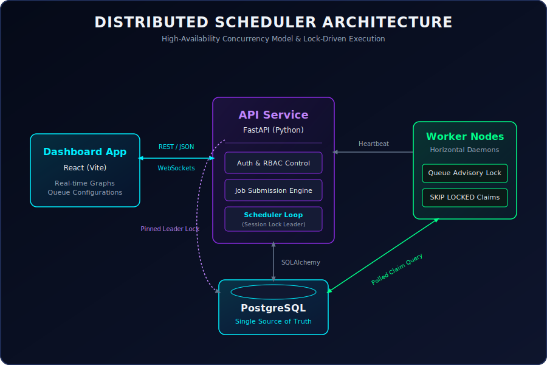
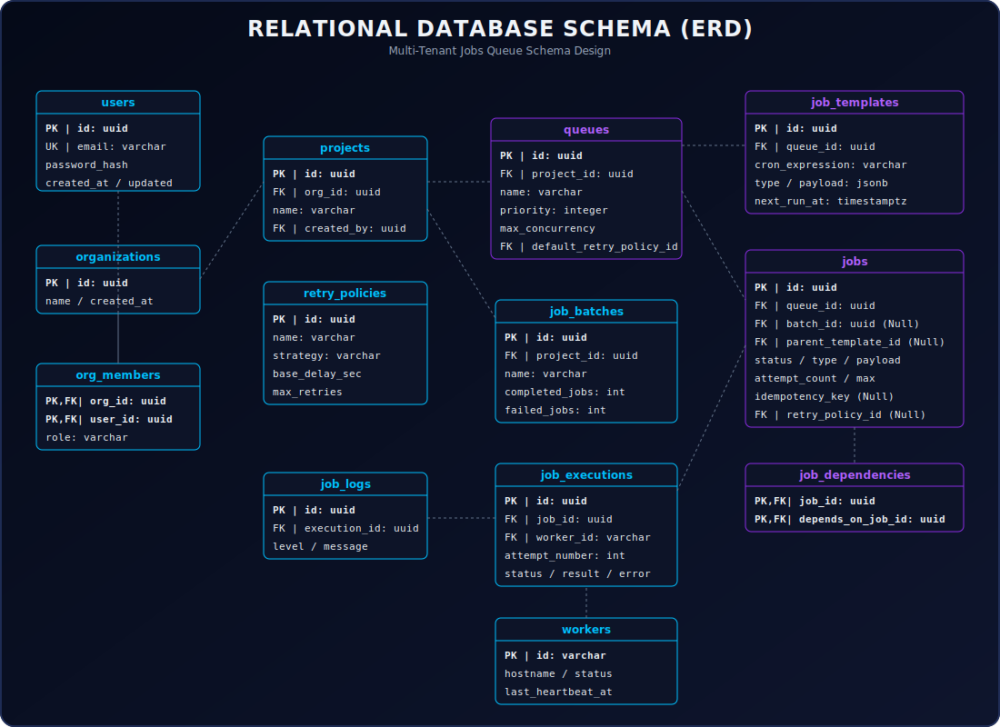

# Distributed Job Scheduler

A production-inspired distributed background job scheduling platform designed for high-availability, safety, and auditable logging. It leverages **PostgreSQL** as a single source of truth for queue states, utilizing transaction-level advisory locks and atomic claiming (`SELECT FOR UPDATE SKIP LOCKED`) to coordinate multiple worker nodes concurrently without race conditions or duplicate execution.

---

## Key Features

1. **Atomic Job Claiming (SKIP LOCKED)**: Under high load, concurrent workers poll the same queue table with zero duplicate executions and zero locks contention.
2. **Safe Concurrency Limits**: Enforces queue-level `max_concurrency` via transaction-scoped advisory locks, eliminating race conditions.
3. **True Multi-Parent DAG Workflows**: Supports job chaining and complex graph execution via a join table with application-level depth-first search (DFS) cycle protection.
4. **Recurring Cron Jobs**: Manages schedules separately from executions via a templates-vs-instances pattern, promoting jobs dynamically.
5. **Atomic Batch Tracking**: Atomically increments batch completion status inside PostgreSQL, avoiding read-modify-write lost updates.
6. **Observability & Auditing**: Tracks every attempt separately, retaining complete execution logs and timing stats even if the parent job is deleted.
7. **Premium Glassmorphic Dashboard**: A stunning dashboard for monitoring workers, configuring queues, viewing live logs, and manual retries.

---

## High-Level Architecture

The platform consists of:
*   **API Service (FastAPI)**: Serves REST endpoints, WebSockets for live statistics, and runs a leader-elected scheduler thread.
*   **Worker Daemons (Independent Processes)**: Multi-threaded background workers executing job handlers, updating heartbeat signals, and supporting graceful shutdown.
*   **Database (Postgres)**: Serves as the robust, atomic transactional queue state-store.
*   **Web Dashboard (React + Vite)**: A cyber-themed glassmorphism interface with dark mode and live charts.



---

## Database Schema (ERD)

The database schema is highly normalized and fully detailed below:



---

## Quick Start Guide

### 1. Prerequisites
*   Python 3.10+
*   Node.js v18+
*   PostgreSQL running on `localhost:5432`

---

### 2. Backend Setup & Run

1.  **Install dependencies**:
    ```powershell
    pip install -r backend/requirements.txt
    ```

2.  **Verify Database Connection**:
    Ensure Postgres is running. The default credentials in `backend/app/config.py` are:
    *   **Host**: `localhost`
    *   **Port**: `5432`
    *   **User**: `openpg`
    *   **Password**: `openpgpwd`
    *   **Database**: `job_scheduler`

3.  **Initialize Tables**:
    Run the setup command to automatically scaffold all database tables, constraints, and indexes:
    ```powershell
    python -c "from backend.app.database import sync_engine, Base; from backend.app import models; Base.metadata.create_all(bind=sync_engine); print('Tables Created!')"
    ```

4.  **Run API Server**:
    Start the FastAPI application on port 8000:
    ```powershell
    python backend/run.py
    ```
    The interactive Swagger API documentation will be available at **`http://localhost:8000/docs`**.

5.  **Run Worker Nodes**:
    Launch one or more independent worker processes:
    ```powershell
    python backend/app/worker.py
    ```

---

### 3. Run Automated Tests

To run the complete test suite verifying concurrency limits, claiming, retry policies, batches, and cycle detection:

1.  **Create Test Database**:
    ```sql
    CREATE DATABASE job_scheduler_test;
    ```
2.  **Run pytest**:
    ```powershell
    python -m pytest backend/tests/
    ```

---

### 4. Frontend Setup & Run

1.  **Navigate and install dependencies**:
    ```powershell
    cd frontend
    npm install
    ```

2.  **Run React App**:
    Start the Vite development server on port 5173:
    ```powershell
    npm run dev
    ```
    Access the dashboard at **`http://localhost:5173`**.

---

## Project Structure

```
/
├── backend/
│   ├── app/
│   │   ├── config.py         # Config loader
│   │   ├── database.py       # SQLModel/SQLAlchemy Async engines
│   │   ├── models.py         # Relational database models
│   │   ├── schemas.py        # Pydantic request/response schemas
│   │   ├── security.py       # Hashing and JWT utils
│   │   ├── job_handlers.py   # Simulates emails, reports, HTTP executors
│   │   ├── scheduler.py      # Leader-elected template cloner
│   │   ├── worker.py         # Queue-level atomic claiming worker
│   │   ├── main.py           # FastAPI app registration
│   │   └── routers/          # Modular API endpoints
│   ├── tests/                # Concurrency, DAG, & Retry tests
│   └── requirements.txt      # Python dependencies
├── frontend/
│   ├── src/
│   │   ├── App.jsx           # Dashboard app core
│   │   └── App.css           # Glassmorphic cyber theme stylesheet
│   ├── package.json          # Node dependencies
│   └── vite.config.js        # API proxying settings
├── design_decisions.md       # Technical design trade-offs document
├── architecture_diagram.svg  # System architecture graphic
└── er_diagram.svg            # Database schema ERD
```
