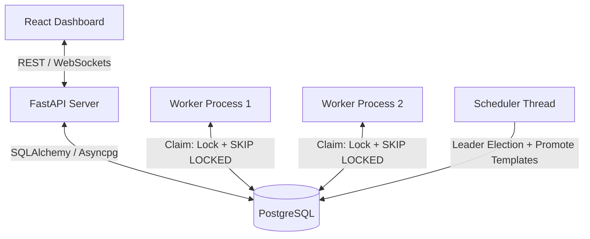

# Implementation Plan - Distributed Job Scheduler

This document details the implementation plan for the **Distributed Job Scheduler** platform. It describes the system architecture, database design (ER), backend API design, worker execution model, and verification plan.

---

## High-Level Architecture

We will implement a modular, distributed architecture consisting of:
1. **API Service (FastAPI)**: Serves the REST API, handles user authentication, dashboard endpoints, project/queue management, job submission, WebSocket live updates, and provides a lightweight background thread for the **Scheduler Loop** (to enqueue scheduled/recurring jobs).
2. **Worker Daemon(s) (Independent Processes)**: Polling processes that grab jobs from the PostgreSQL queue, execute them in local worker thread pools, send heartbeat signals to the database, and handle graceful shutdown.
3. **Database (PostgreSQL)**: Serves as the single source of truth for both configurations and queue states, utilizing transaction-level queue locks and atomic claiming (`SELECT FOR UPDATE SKIP LOCKED`) to coordinate work between multiple worker nodes safely and concurrently.
4. **Dashboard (React + Vite + Vanilla CSS)**: A premium-looking dashboard with modern glassmorphism, responsive navigation, live updates, queue management, job inspection, execution log viewer, and system health metrics.



---

## Relational Database Schema

We will create a database called `job_scheduler`. The schema is designed for multi-tenancy (Organizations -> Projects -> Queues -> Jobs) and ensures strict audit logs are retained even if entities are deleted.

### 1. `users`
*   `id`: UUID (PK, default uuid_generate_v4())
*   `email`: VARCHAR(255) (Unique, Indexed)
*   `password_hash`: VARCHAR(255)
*   `created_at`: TIMESTAMPTZ (Default now())
*   `updated_at`: TIMESTAMPTZ (Default now())

### 2. `organizations`
*   `id`: UUID (PK)
*   `name`: VARCHAR(255)
*   `created_at`: TIMESTAMPTZ (Default now())

### 3. `org_members` (Join Table for RBAC)
*   `org_id`: UUID (FK -> organizations.id, ON DELETE CASCADE)
*   `user_id`: UUID (FK -> users.id, ON DELETE CASCADE)
*   `role`: VARCHAR(50) (Enum: `owner`, `admin`, `member`)
*   *Composite PK*: `(org_id, user_id)`

### 4. `projects`
*   `id`: UUID (PK)
*   `org_id`: UUID (FK -> organizations.id, ON DELETE CASCADE, Indexed)
*   `name`: VARCHAR(255)
*   `created_by`: UUID (FK -> users.id, ON DELETE SET NULL)
*   `created_at`: TIMESTAMPTZ (Default now())
*   `deleted_at`: TIMESTAMPTZ (Nullable, for soft-delete)

### 5. `retry_policies`
*   `id`: UUID (PK)
*   `name`: VARCHAR(255)
*   `strategy`: VARCHAR(50) (Enum: `fixed`, `linear`, `exponential`)
*   `base_delay_seconds`: INTEGER (Default 5)
*   `max_retries`: INTEGER (Default 3)
*   `max_delay_seconds`: INTEGER (Nullable, caps exponential growth)
*   `created_at`: TIMESTAMPTZ (Default now())

### 6. `queues`
*   `id`: UUID (PK)
*   `project_id`: UUID (FK -> projects.id, ON DELETE CASCADE, Indexed)
*   `name`: VARCHAR(255)
*   `priority`: INTEGER (Default 1, higher executes first)
*   `max_concurrency`: INTEGER (Default 5)
*   `is_paused`: BOOLEAN (Default FALSE)
*   `default_retry_policy_id`: UUID (FK -> retry_policies.id, ON DELETE SET NULL)
*   `created_at`: TIMESTAMPTZ (Default now())
*   `deleted_at`: TIMESTAMPTZ (Nullable, for soft-delete)
*   *Unique Constraint*: `(project_id, name)`

### 7. `job_batches` (Atomic Batch Tracking)
*   `id`: UUID (PK)
*   `project_id`: UUID (FK -> projects.id, ON DELETE CASCADE, Indexed)
*   `name`: VARCHAR(255)
*   `total_jobs`: INTEGER (Default 0)
*   `completed_jobs`: INTEGER (Default 0)
*   `failed_jobs`: INTEGER (Default 0)
*   `status`: VARCHAR(50) (Default `pending`, Enum: `pending`, `running`, `completed`, `failed`)
*   `created_at`: TIMESTAMPTZ (Default now())
*   *Atomic Updates*: Updates to batch counters (e.g. `completed_jobs`, `failed_jobs`) must be executed directly as SQL increments (`SET completed_jobs = completed_jobs + 1`) rather than application-side read-modify-write.

### 8. `job_templates` (For Recurring Jobs)
*   `id`: UUID (PK)
*   `queue_id`: UUID (FK -> queues.id, ON DELETE CASCADE, Indexed)
*   `name`: VARCHAR(255)
*   `type`: VARCHAR(255) (e.g. `email_send`)
*   `payload`: JSONB
*   `cron_expression`: VARCHAR(255)
*   `status`: VARCHAR(50) (Default `active`, Enum: `active`, `paused`)
*   `next_run_at`: TIMESTAMPTZ (Indexed)
*   `created_at`: TIMESTAMPTZ (Default now())
*   `updated_at`: TIMESTAMPTZ (Default now())

### 9. `jobs`
*   `id`: UUID (PK)
*   `queue_id`: UUID (FK -> queues.id, ON DELETE CASCADE, Indexed)
*   `batch_id`: UUID (FK -> job_batches.id, ON DELETE SET NULL, Nullable, Indexed)
*   `parent_template_id`: UUID (FK -> job_templates.id, ON DELETE SET NULL, Nullable, Indexed)
*   `type`: VARCHAR(255) (e.g., `email_send`, `report_generation`, `data_sync`, `http_request`)
*   `payload`: JSONB
*   `status`: VARCHAR(50) (Indexed) (Enum: `queued`, `scheduled`, `claimed`, `running`, `completed`, `failed`, `dead_letter`)
*   `priority`: INTEGER (Default 0, overrides queue priority)
*   `run_at`: TIMESTAMPTZ (Indexed, Nullable. If null, runs immediately)
*   `retry_policy_id`: UUID (FK -> retry_policies.id, ON DELETE SET NULL, Nullable, overrides queue policy)
*   `attempt_count`: INTEGER (Default 0)
*   `max_attempts`: INTEGER (Default 3)
*   `idempotency_key`: VARCHAR(255) (Nullable)
*   `created_at`: TIMESTAMPTZ (Default now())
*   `updated_at`: TIMESTAMPTZ (Default now())
*   *Composite Index*: `(queue_id, status, priority DESC, run_at ASC)` -> optimized for queue poll.
*   *Unique Constraint*: `(queue_id, idempotency_key)` -> ensures execution uniqueness per queue.

### 10. `job_dependencies` (DAG Workflows)
*   `job_id`: UUID (FK -> jobs.id, ON DELETE CASCADE, Indexed) -> The child job that has dependencies.
*   `depends_on_job_id`: UUID (FK -> jobs.id, ON DELETE CASCADE, Indexed) -> The parent job that must finish first.
*   *Composite PK*: `(job_id, depends_on_job_id)` -> Supports true multi-parent Directed Acyclic Graph (DAG) dependencies.

### 11. `job_executions` (Audit History)
*   `id`: UUID (PK)
*   `job_id`: UUID (FK -> jobs.id, ON DELETE SET NULL, Nullable, Indexed) -> *Audit history remains intact if a job row is deleted.*
*   `worker_id`: VARCHAR(255) (FK -> workers.id, ON DELETE SET NULL, Nullable)
*   `attempt_number`: INTEGER
*   `status`: VARCHAR(50) (Enum: `running`, `completed`, `failed`, `timed_out`)
*   `started_at`: TIMESTAMPTZ (Default now())
*   `finished_at`: TIMESTAMPTZ (Nullable)
*   `error_message`: TEXT (Nullable)
*   `result`: JSONB (Nullable)

### 12. `job_logs`
*   `id`: UUID (PK)
*   `execution_id`: UUID (FK -> job_executions.id, ON DELETE CASCADE, Indexed)
*   `timestamp`: TIMESTAMPTZ (Default now())
*   `level`: VARCHAR(50) (Enum: `info`, `warn`, `error`)
*   `message`: TEXT

### 13. `workers`
*   `id`: VARCHAR(255) (PK, usually worker hostname + process ID)
*   `hostname`: VARCHAR(255)
*   `status`: VARCHAR(50) (Enum: `idle`, `busy`, `offline`)
*   `last_heartbeat_at`: TIMESTAMPTZ (Default now())
*   `registered_at`: TIMESTAMPTZ (Default now())
*   `current_job_id`: UUID (FK -> jobs.id, ON DELETE SET NULL, Nullable)

---

## Core Algorithmic Queries

### 1. Atomic Job Claiming (Race-Free concurrency limits & DAG dependencies)

To prevent race conditions where concurrent workers overshoot the queue's `max_concurrency`, the worker service will claim jobs by executing a transaction that:
1. Identifies candidate active queues that are not paused and have jobs due.
2. Iterates over candidate queues and attempts to acquire a transaction-level advisory lock on the queue ID.
3. Once the queue is locked, count the active running jobs, evaluate concurrency limits, check DAG parent completion, and execute a `SKIP LOCKED` claim on a single job.

*Advisory Lock Hash Collision Trade-off Note*: We use `hashtext(:queue_id::text)` which returns a 32-bit integer. There is a tiny but non-zero probability of hash collisions, causing two unrelated queues to briefly serialize claims against each other. This is a conscious performance trade-off for simplicity.

**Transaction SQL Steps (per queue candidate):**
```sql
-- Step 1: Acquire transaction-level advisory lock for the target queue
SELECT pg_advisory_xact_lock(hashtext(:queue_id::text));

-- Step 2: Query running job count, queue config, and claim next job atomically
UPDATE jobs
SET 
    status = 'claimed', 
    updated_at = now()
WHERE id = (
    SELECT j.id 
    FROM jobs j
    JOIN queues q ON j.queue_id = q.id
    WHERE j.queue_id = :queue_id
      AND j.status = 'queued'
      AND q.is_paused = FALSE
      AND (j.run_at IS NULL OR j.run_at <= now())
      -- Check concurrency limit safely (queue is transaction-locked)
      AND (
          SELECT COUNT(*) 
          FROM jobs running_j 
          WHERE running_j.queue_id = :queue_id 
            AND running_j.status = 'running'
      ) < q.max_concurrency
      -- Ensure DAG dependencies are met: all parents must be completed
      AND NOT EXISTS (
          SELECT 1 
          FROM job_dependencies jd
          JOIN jobs parent_j ON jd.depends_on_job_id = parent_j.id
          WHERE jd.job_id = j.id
            AND parent_j.status != 'completed'
      )
    ORDER BY j.priority DESC, j.run_at ASC
    FOR UPDATE SKIP LOCKED
    LIMIT 1
)
RETURNING *;
```

### 2. Scheduler Leader Election

If multiple API instances are scaled horizontally, we prevent redundant scheduling cycles using a session-level advisory lock. The scheduler loop will only execute if it holds the leader lock:

```sql
-- Acquire session lock (e.g. key = 888888). Returns true if lock was acquired, false if already held by another node.
SELECT pg_try_advisory_lock(888888);
```
At startup, the background scheduler thread attempts to acquire this lock. 

*Pinned Connection Requirement*: Session-level locks are bound to a specific PostgreSQL database connection. The scheduler daemon must use a dedicated, single, long-lived (pinned) connection for this check, rather than taking one from the general connection pool, to prevent pool recycling from dropping the lock.

### 3. Recurring Job Cloner

Instead of editing a single recurring row, the scheduler fetches due templates:
```sql
SELECT * FROM job_templates 
WHERE status = 'active' AND next_run_at <= now();
```
For each template:
1. We insert a new execution instance in `jobs` with `status = 'queued'`, `parent_template_id = template.id`, and `run_at = now()`.
2. We calculate the next `next_run_at` using `croniter` and update the template:
   ```sql
   UPDATE job_templates SET next_run_at = :next_run, updated_at = now() WHERE id = :id;
   ```

---

## Proposed Changes

We will build the codebase inside `d:\Mine\coditity` using a clear directory structure:

### Backend Files
1. **[NEW] [backend/requirements.txt](file:///d:/Mine/coditity/backend/requirements.txt)**: Python package list (FastAPI, Uvicorn, SQLAlchemy, Psycopg2-binary, Asyncpg, PyJWT, Bcrypt, Croniter, Pydantic).
2. **[NEW] [backend/app/config.py](file:///d:/Mine/coditity/backend/app/config.py)**: Configuration loader using `pydantic-settings`.
3. **[NEW] [backend/app/database.py](file:///d:/Mine/coditity/backend/app/database.py)**: Async database session management and engine initialization.
4. **[NEW] [backend/app/models.py](file:///d:/Mine/coditity/backend/app/models.py)**: SQLAlchemy models mapping to the database tables.
5. **[NEW] [backend/app/schemas.py](file:///d:/Mine/coditity/backend/app/schemas.py)**: Pydantic input/output schemas for the API, including batch creation formats.
6. **[NEW] [backend/app/security.py](file:///d:/Mine/coditity/backend/app/security.py)**: Password hashing, verify and token creation/verification.
7. **[NEW] [backend/app/job_handlers.py](file:///d:/Mine/coditity/backend/app/job_handlers.py)**: Implement task executors (e.g. simulating HTTP calls, sending email, generating reports) with **Pydantic schema validation** per job type.
8. **[NEW] [backend/app/worker.py](file:///d:/Mine/coditity/backend/app/worker.py)**: Worker service daemon. Uses a ThreadPoolExecutor/ProcessPoolExecutor to run tasks, sends heartbeats, polls using the claim query, handles SIGINT/SIGTERM for graceful shutdowns.
9. **[NEW] [backend/app/scheduler.py](file:///d:/Mine/coditity/backend/app/scheduler.py)**: Scheduler background runner that promotes delayed/cron jobs.
10. **[NEW] [backend/app/routers/...](file:///d:/Mine/coditity/backend/app/routers)**: Modular endpoints for dashboard statistics, batches, jobs, queues, projects, workers, templates, and auth.
11. **[NEW] [backend/app/main.py](file:///d:/Mine/coditity/backend/app/main.py)**: FastAPI application setup, middleware, routers registration, startup/shutdown lifecycles (which start the scheduler).
12. **[NEW] [backend/run.py](file:///d:/Mine/coditity/backend/run.py)**: Backend dev-runner.

### Frontend Files
1. **[NEW] [frontend/package.json](file:///d:/Mine/coditity/frontend/package.json)**: Node dependencies (React, Lucide icons, Chart.js / Recharts).
2. **[NEW] [frontend/vite.config.js](file:///d:/Mine/coditity/frontend/vite.config.js)**: Configures Vite server and API proxying to backend (port 8000).
3. **[NEW] [frontend/src/App.css](file:///d:/Mine/coditity/frontend/src/App.css)**: Core custom styling (Premium Glassmorphism, Neon/Cyber accents, responsive grid).
4. **[NEW] [frontend/src/App.jsx](file:///d:/Mine/coditity/frontend/src/App.jsx)**: Main routing, Sidebar layout, state management for user authentication.
5. **[NEW] [frontend/src/pages/...](file:///d:/Mine/coditity/frontend/src/pages)**: React pages for Auth (Login/Register), Dashboard Overview (Metrics, Chart), Queues management, Jobs inspection (including Batches details), and Worker monitoring.

### Documentation & Verification Files
1. **[NEW] [README.md](file:///d:/Mine/coditity/README.md)**: Setup, build, run, and usage instructions, clearly identifying `/docs` for API documentation.
2. **[NEW] [design_decisions.md](file:///d:/Mine/coditity/design_decisions.md)**: In-depth engineering rationale covering Postgres as queues, advisory locks, worker reliability, and error handling.
3. **[NEW] [architecture_diagram.svg](file:///d:/Mine/coditity/architecture_diagram.svg)**: Scalable vector graphic visualizing system design.
4. **[NEW] [er_diagram.svg](file:///d:/Mine/coditity/er_diagram.svg)**: Relational ER diagram of the database.
5. **[NEW] [backend/tests/...](file:///d:/Mine/coditity/backend/tests)**: Automated unit and integration tests using pytest to verify claiming, retries, concurrency limits, and DLQ.

---

## Verification Plan

### Automated Tests
We will execute unit tests inside the backend directory:
```powershell
pip install pytest pytest-asyncio
pytest backend/tests/
```
The test suite will verify:
*   **Job Claiming Concurrency**: Ensure that two concurrent transactions claim separate jobs and never duplicate work.
*   **Retry Mechanisms**: Confirm that failed jobs are rescheduled with exponential backoff delays and capped by max retries.
*   **Concurrency Limits**: Verify that queues do not exceed their configured `max_concurrency` limit of running jobs.
*   **DAG Workflows**: Verify child jobs are not enqueued until parent jobs complete (using the `job_dependencies` join table).
*   **Batch Atomicity**: Verify that a batch is created atomically and progress counts update correctly on job success/failure.

### Manual Verification
1.  **Worker Scaling**: We will launch multiple worker processes in parallel:
    ```powershell
    python backend/app/worker.py
    ```
    We will submit a batch of 20 simulated long-running jobs (e.g. 5-second sleep) and verify via logs and the DB that they are distributed dynamically across the active workers.
2.  **Graceful Shutdown**: Send a `SIGINT` (Ctrl+C) to a busy worker. Verify that the running job completes successfully, the worker updates its status to offline, and then exits cleanly.
3.  **Dashboard Visuals**: Open the React UI at `http://localhost:5173`. Verify authentication, create a queue, pause/resume it, trigger new jobs (immediate, scheduled, cron), check active worker states, and watch real-time metrics update.
